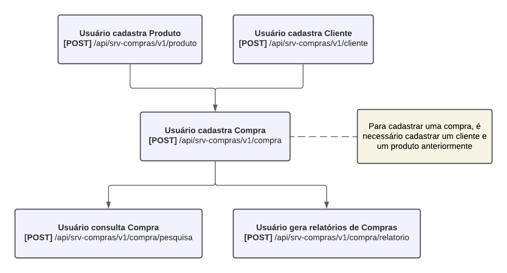

# API Compras

Este projeto é um sistema de cadastro de compras desenvolvido em Java com Spring Boot. Ele utiliza uma arquitetura
RESTful para gerenciar as entidades Compra, Produto e Cliente, permitindo que usuários cadastrem, consultem e obtenham
relatórios de compras.

## Tópicos

- [Fluxo](#fluxo)
- [Funcionalidades](#funcionalidades)
- [Swagger](#swagger)
- [End Points](#end-points)
- [Testes unitários](#testes-unitários)
- [Tecnologias utilizadas](#tecnologias-utilizadas)
- [Funcionalidades futuras](#Implementações-futuras) 
- [Execução local](#Execução-local)
- [Desenvolvedor](#desenvolvedor)

## Fluxo

1. O usuário deve cadastrar um produto;
2. O usuário pode cadastrar um cliente;
3. Utilizando a referência do produto e do cliente, o usuário pode cadastrar uma compra;
4. Ao cadastrar uma compra, o usuário pode realizar pesquisas por compras utilizando parâmetros de busca;
5. Ao cadastrar uma compra, o usuário pode gerar relatórios de compras por um período de datas data.

## Funcionalidades

:heavy_check_mark: `Cadastro de Produto:` A API possibilita o cadastro de produtos;

:heavy_check_mark: `Cadastro de Cliente:` A API possibilita o cadastro de clientes;

:heavy_check_mark: `Cadastro de Compra:` A API possibilita o cadastro de compras utilizando os dados de clientes e
produtos previamente cadastrados;

:heavy_check_mark: `Pesquisa de Compras:` A API possibilita a pesquisa de compras através de diversos parâmetros.

:heavy_check_mark: `Relatório de Compras:` A API possibilita a gerar relatórios de compras por períodos.

## Swagger

> Para acessar o swagger basta acessar o endpoint /documentacao-api

## End points

> [POST] Cadastra produto:/api/srv-compras/v1/produto 
> Cadastra um novo produto

> [POST] Cadastra cliente: /api/srv-compras/v1/cliente 
> Cadastra um novo cliente

> [POST] Cadastra compra: /api/srv-compras/v1/compra 
> Cadastra uma nova compra

> [POST] Pesquisa compras: /api/srv-compras/v1/compra/pesquisa 
> Pesquisa compras

> [GET] Obtem relatórios de compras 
> Obtem relatórios de compras

## Testes unitários

> Os testes unitários foram realizados com cobertura de testes de 89% das linhas do projeto

## Tecnologias Utilizadas

- Java 17
- Spring Boot 3.3.4
- Swagger
- JPA
- H2
- Postman
- Lombok
- J Unit
- 
## Implementações futuras

Futuramente a aplicação deverá possuir as seguintes implementações:
- Melhorias de coberturas de testes
- Cache
- Perfis DEV, PROD melhorados
- Preparar pipeline para deploy em cloud

## Execução local

1. Para clonar o projeto basta utilizar o git clone com a url: https://github.com/LagrotaGabriel/gestorDeCompras.git
2. A porta padrão da aplicação está definida em 8070. Então as requisições deverão apontar para essa porta
3. Cada módulo de aplicação (cliente/compras/produto) possui um diretório "docs". Neste diretório está disponível a 
collection do postman de cada um dos módulos da aplicação. As collections já possuem requisições de sucesso e de erro 
de exemplo
4. Para acessar o Swagger da aplicação, deverá ser utilizado o endpoint /documentacao-api
5. As credenciais para acesso do H2 são: Usuário -> admin e a senha é vazia.

## Desenvolvedor

[ Gabriel Lagrota](https://github.com/LagrotaGabriel)